# SIMPEG - Sistem Informasi Manajemen Pegawai

Aplikasi manajemen kepegawaian berbasis web untuk **Kementerian Imigrasi dan Pemasyarakatan (Kemenipas)** yang dibangun menggunakan **Laravel 12**, **SQLite**, dan **Tailwind CSS v4**.

## Fitur Utama

- **Dashboard** — Ringkasan data pegawai dengan chart distribusi (golongan, gender, usia, unit kerja) dan alert KGB/Pensiun
- **Manajemen Pegawai** — CRUD lengkap dengan pencarian AJAX, paginasi server-side (DB-level), validasi format NIP, dan **One-Stop Creation Flow** (pilih pangkat & jabatan saat create → gaji otomatis + auto-generate RiwayatPangkat & RiwayatJabatan)
- **Profil Pegawai** — Halaman detail dengan **9 tab** termasuk **Timeline Karir** (gabungan kronologis semua riwayat dalam vertical timeline card), **Data Completeness Indicator** (progress bar 8 kategori), **Export PDF Profil** (biodata + riwayat lengkap), dan **Edit Form Guidance** (field otomatis ditandai readonly + banner info)
- **Biodata Pegawai** — Gelar depan/belakang, bagian (5 seksi Kanim), tipe pegawai (PNS/CPNS/PPPK), status kepegawaian, unit kerja — semua dinormalisasi ke tabel master data dengan FK
- **Riwayat Kepegawaian** — 7 modul riwayat (Pangkat, Jabatan, KGB, Hukuman Disiplin, Pendidikan, Latihan Jabatan, Penilaian Kinerja)
- **Monitoring KGB** — Alert otomatis pegawai yang mendekati/eligible kenaikan gaji berkala (siklus 2 tahun), kalkulasi gaji baru otomatis berdasarkan PP 15/2019, integrasi hukuman disiplin (penundaan KGB)
- **Kenaikan Pangkat** — Analisis eligibilitas berdasarkan syarat masa kerja, SKP, latihan, dan hukuman disiplin
- **Hukuman Disiplin Hybrid (PP 94/2021)** — Sistem hukdis lengkap dengan 3 status (Aktif/Selesai/Dipulihkan), 6 jenis sanksi, mekanisme Type 2 hard-update (penurunan pangkat/jabatan/pembebasan), pemulihan (pemulihan pangkat, jabatan, dan gaji otomatis), serta integrasi blokir KGB dan kenaikan pangkat
- **Alert Pensiun** — Monitoring pensiun berdasarkan BUP dengan level alert (Hijau/Kuning/Merah/Hitam)
- **DUK** — Daftar Urut Kepangkatan dengan ranking otomatis sesuai hierarki BKN
- **Satyalencana** — Identifikasi kandidat penghargaan Satyalencana Karya Satya (10/20/30 tahun)
- **Master Data** — CRUD Jabatan (dengan rumpun jabatan), Tabel Gaji (PP 15/2019), referensi Golongan Ruang, **serta 8 tabel referensi pegawai** (Tipe Pegawai, Status Kepegawaian, Bagian, Unit Kerja, Jenis Kelamin, Agama, Status Pernikahan, Golongan Darah) via generic `MasterDataController`
- **Export PDF & Excel** — Semua laporan (KGB, Pensiun, DUK, Kenaikan Pangkat, Satyalencana) bisa diekspor ke PDF dan Excel; **profil individual pegawai** bisa di-export ke PDF
- **Activity Log** — Pencatatan otomatis setiap perubahan data pegawai dan riwayat menggunakan Spatie Activity Log
- **Document Management** — Upload dan manajemen file SK (PDF, maks 5MB) dengan penamaan bermakna (`NIP_Module_Timestamp_NamaAsli.pdf`), inline PDF preview di browser, link Google Drive opsional
- **UX: Tab Retention & Flash Messages** — Setelah CRUD riwayat, halaman otomatis kembali ke tab yang aktif; alert deskriptif dengan icon, judul, pesan detail, dan tombol dismiss
- **Caching** — Dashboard data dan career timeline di-cache 5 menit via `Cache::remember()`, invalidasi otomatis via Observer
- **Profil & Ganti Password** — Manajemen profil user dan update password
- **Autentikasi** — Login/logout dengan role-based access (SuperAdmin, HR)

## Persyaratan Sistem

| Komponen | Versi Minimum |
| -------- | ------------- |
| PHP      | 8.2+          |
| Composer | 2.x           |
| Node.js  | 18+           |
| NPM      | 9+            |

## Instalasi & Setup

### 1. Clone Repository

```bash
git clone <repository-url>
cd SIMPEG.Laravel
```

### 2. Install Dependensi

```bash
composer install
npm install
```

### 3. Konfigurasi Environment

```bash
cp .env.example .env
php artisan key:generate
```

Pastikan konfigurasi `.env` berikut:

```env
APP_NAME=SIMPEG
APP_LOCALE=id
APP_FAKER_LOCALE=id_ID
DB_CONNECTION=sqlite
```

### 4. Buat Database SQLite

```bash
# Linux/Mac
touch database/database.sqlite

# Windows (PowerShell)
New-Item database/database.sqlite -ItemType File
```

### 5. Jalankan Migrasi & Seeder

```bash
php artisan migrate --seed
```

Ini akan membuat semua tabel dan mengisi data sampel:

- 2 user (superadmin@kemenipas.go.id / password)
- 17 golongan/pangkat (I/a s.d IV/e)
- 37 jabatan master data (3 rumpun: Struktural, Imigrasi, Pemasyarakatan)
- 100 pegawai dengan riwayat lengkap
- Tabel gaji PP 15/2019 (untuk kalkulasi KGB otomatis)

### 6. Build Assets Frontend

```bash
npm run build
```

### 7. Jalankan Aplikasi

```bash
php artisan serve
```

Akses di: **http://localhost:8000**

**Login sebagai admin:**

- Email: `superadmin@kemenipas.go.id`
- Password: `password`

## Struktur Project

```
app/
├── DTOs/               # 8 DTO class (PegawaiDTO + 7 Riwayat DTO)
├── Enums/              # 5 PHP Enum aktif (JenisSanksi, StatusHukdis, TingkatHukuman, JenisJabatan, RumpunJabatan) + 4 deprecated
├── Exports/            # 5 Excel Export class (KGB, Pensiun, DUK, Kenaikan Pangkat, Satyalencana)
├── Http/
│   ├── Controllers/    # 18 Controller (Auth, Dashboard, Pegawai, Riwayat, Export, Jabatan, TabelGaji, dll)
│   ├── Requests/       # 19 FormRequest (Store/Update untuk setiap entitas)
│   └── Resources/      # 1 API Resource (PegawaiResource)
├── Models/             # 21 Eloquent Model (Pegawai, GolonganPangkat, Jabatan, TabelGaji, dll)
├── Observers/          # 3 Observer (Pegawai, RiwayatKgb, RiwayatPangkat) + 6 model event listeners
├── Providers/          # AppServiceProvider
└── Services/           # 14 Service Class (business logic layer)
database/
├── factories/          # Model factories (UserFactory, PegawaiFactory)
├── migrations/         # 19 migration files
├── seeders/            # 6 seeder (User, MasterData, GolonganPangkat, Pegawai, TabelGaji, Database)
resources/views/
├── layouts/app.blade.php          # Layout utama dengan responsive sidebar
├── auth/login.blade.php           # Halaman login
├── dashboard/index.blade.php      # Dashboard dengan chart
├── pegawai/                       # 5 view (index, show, create, edit, _form)
├── riwayat/                       # 14 view (create/edit untuk 7 riwayat)
├── kgb/                           # Monitoring KGB
├── kenaikan-pangkat/              # Eligibilitas kenaikan pangkat
├── pensiun/                       # Alert pensiun
├── duk/                           # Daftar Urut Kepangkatan
├── satyalencana/                  # Kandidat Satyalencana
├── admin/                         # 4 view (CRUD Jabatan, Tabel Gaji, Golongan)
├── exports/                       # 7 template PDF (dashboard, duk, kgb, pensiun, kenaikan-pangkat, satyalencana, pegawai-profile)
├── activity-log/                  # Riwayat aktivitas sistem
└── profile/                       # Profil & ganti password
```

## Teknologi

| Kategori         | Teknologi                          |
| ---------------- | ---------------------------------- |
| **Backend**      | Laravel 12 (PHP 8.2+)              |
| **Database**     | SQLite                             |
| **Frontend**     | Blade Templates + Tailwind CSS 4.x |
| **Build Tool**   | Vite                               |
| **Charts**       | Chart.js 4 (CDN)                   |
| **Font**         | Inter (Google Fonts)               |
| **PDF Export**   | barryvdh/laravel-dompdf 3.x        |
| **Excel Export** | maatwebsite/excel 3.x              |
| **Activity Log** | spatie/laravel-activitylog 4.x     |

## Skema Database (ERD)

Berikut adalah Entity Relationship Diagram (ERD) dari seluruh tabel dalam aplikasi SIMPEG:

```mermaid
erDiagram
    users {
        bigint id PK
        string name
        string email UK
        string password
        string role "SuperAdmin | HR"
        timestamp created_at
        timestamp updated_at
    }

    tipe_pegawais {
        bigint id PK
        string nama UK
        timestamp created_at
        timestamp updated_at
    }

    status_kepegawaans {
        bigint id PK
        string nama UK
        timestamp created_at
        timestamp updated_at
    }

    bagians {
        bigint id PK
        string nama UK
        timestamp created_at
        timestamp updated_at
    }

    unit_kerjas {
        bigint id PK
        string nama UK
        timestamp created_at
        timestamp updated_at
    }

    jenis_kelamins {
        bigint id PK
        string nama UK
        timestamp created_at
        timestamp updated_at
    }

    agamas {
        bigint id PK
        string nama UK
        timestamp created_at
        timestamp updated_at
    }

    status_pernikahans {
        bigint id PK
        string nama UK
        timestamp created_at
        timestamp updated_at
    }

    golongan_darahs {
        bigint id PK
        string nama UK
        timestamp created_at
        timestamp updated_at
    }

    golongan_pangkats {
        bigint id PK
        tinyint golongan_ruang UK "1-17 level numerik"
        string label "I/a s.d IV/e"
        string pangkat "Nama pangkat resmi"
        string golongan_group "I, II, III, IV"
        string min_pendidikan
        text keterangan
        boolean is_active
        timestamp created_at
        timestamp updated_at
    }

    jabatans {
        bigint id PK
        string nama_jabatan
        tinyint jenis_jabatan "FK Enum JenisJabatan"
        int bup "Batas Usia Pensiun"
        int eselon_level
        int kelas_jabatan
        tinyint rumpun "FK Enum RumpunJabatan"
        boolean is_active
        timestamp created_at
        timestamp updated_at
    }

    pegawais {
        bigint id PK
        string nip UK
        string gelar_depan
        string nama_lengkap
        string gelar_belakang
        string tempat_lahir
        date tanggal_lahir
        bigint jenis_kelamin_id FK
        bigint agama_id FK
        bigint status_pernikahan_id FK
        bigint golongan_darah_id FK
        text alamat
        string no_telepon
        string email
        date tmt_cpns
        date tmt_pns
        bigint tipe_pegawai_id FK
        bigint status_kepegawaian_id FK
        bigint bagian_id FK
        bigint unit_kerja_id FK
        string foto_path
        boolean is_active
        decimal gaji_pokok "15,2 — denormalized cache"
        string npwp
        string no_karpeg
        string no_taspen
        string sk_pensiun_nomor
        date sk_pensiun_tanggal
        date tmt_pensiun
        text catatan_pensiun
        string file_sk_pensiun_path
        string link_sk_pensiun_gdrive
        timestamp deleted_at "Soft Delete"
        timestamp created_at
        timestamp updated_at
    }

    riwayat_pangkats {
        bigint id PK
        bigint pegawai_id FK
        bigint golongan_id FK "FK golongan_pangkats"
        string nomor_sk
        date tmt_pangkat
        date tanggal_sk
        string file_pdf_path
        string google_drive_link
        boolean is_hukdis_demotion "Flag demotion hukdis"
        timestamp created_at
        timestamp updated_at
    }

    riwayat_jabatans {
        bigint id PK
        bigint pegawai_id FK
        bigint jabatan_id FK
        string nomor_sk
        date tmt_jabatan
        date tanggal_sk
        string file_pdf_path
        string google_drive_link
        boolean is_hukdis_demotion "Flag demotion hukdis"
        timestamp created_at
        timestamp updated_at
    }

    riwayat_kgbs {
        bigint id PK
        bigint pegawai_id FK
        string nomor_sk
        date tmt_kgb
        decimal gaji_lama "15,2"
        decimal gaji_baru "15,2"
        int masa_kerja_golongan_tahun
        int masa_kerja_golongan_bulan
        string file_pdf_path
        string google_drive_link
        timestamp created_at
        timestamp updated_at
    }

    riwayat_hukuman_disiplins {
        bigint id PK
        bigint pegawai_id FK
        tinyint tingkat_hukuman "FK Enum TingkatHukuman"
        tinyint jenis_sanksi "FK Enum JenisSanksi"
        int durasi_tahun
        string nomor_sk
        date tanggal_sk
        date tmt_hukuman
        date tmt_selesai_hukuman
        text deskripsi
        string file_pdf_path
        string google_drive_link
        string status "Enum StatusHukdis: aktif|selesai|dipulihkan"
        string nomor_sk_pemulihan
        date tanggal_pemulihan
        string file_sk_pemulihan_path
        timestamp created_at
        timestamp updated_at
    }

    riwayat_pendidikans {
        bigint id PK
        bigint pegawai_id FK
        string tingkat_pendidikan
        string institusi
        string jurusan
        int tahun_lulus
        string no_ijazah
        date tanggal_ijazah
        string file_pdf_path
        string google_drive_link
        timestamp created_at
        timestamp updated_at
    }

    riwayat_latihan_jabatans {
        bigint id PK
        bigint pegawai_id FK
        string nama_latihan
        int tahun_pelaksanaan
        int jumlah_jam
        string penyelenggara
        string tempat_pelaksanaan
        string no_sertifikat
        string file_pdf_path
        string google_drive_link
        timestamp created_at
        timestamp updated_at
    }

    riwayat_penghargaans {
        bigint id PK
        bigint pegawai_id FK
        string nama_penghargaan
        int tahun
        int milestone "10|20|30 tahun"
        string nomor_sk
        date tanggal_sk
        string file_pdf_path
        string google_drive_link
        timestamp created_at
        timestamp updated_at
    }

    penilaian_kinerjas {
        bigint id PK
        bigint pegawai_id FK
        int tahun
        string nilai_skp
        string file_pdf_path
        string google_drive_link
        timestamp created_at
        timestamp updated_at
    }

    tabel_gajis {
        bigint id PK
        bigint golongan_id FK "FK golongan_pangkats"
        int masa_kerja_tahun "0, 2, 4, ... 32"
        decimal gaji_pokok "15,2"
        timestamp created_at
        timestamp updated_at
    }

    activity_log {
        bigint id PK
        string log_name
        text description
        string subject_type
        bigint subject_id
        string causer_type
        bigint causer_id
        json properties
        string event
        string batch_uuid
        timestamp created_at
        timestamp updated_at
    }

    %% === MASTER DATA → PEGAWAI RELATIONSHIPS ===

    tipe_pegawais ||--o{ pegawais : "has many"
    status_kepegawaans ||--o{ pegawais : "has many"
    bagians ||--o{ pegawais : "has many"
    unit_kerjas ||--o{ pegawais : "has many"
    jenis_kelamins ||--o{ pegawais : "has many"
    agamas ||--o{ pegawais : "has many"
    status_pernikahans ||--o{ pegawais : "has many"
    golongan_darahs ||--o{ pegawais : "has many"

    %% === RIWAYAT RELATIONSHIPS ===

    golongan_pangkats ||--o{ riwayat_pangkats : "has many"
    golongan_pangkats ||--o{ tabel_gajis : "has many"
    pegawais ||--o{ riwayat_pangkats : "has many"
    pegawais ||--o{ riwayat_jabatans : "has many"
    pegawais ||--o{ riwayat_kgbs : "has many"
    pegawais ||--o{ riwayat_hukuman_disiplins : "has many"
    pegawais ||--o{ riwayat_pendidikans : "has many"
    pegawais ||--o{ riwayat_latihan_jabatans : "has many"
    pegawais ||--o{ riwayat_penghargaans : "has many"
    pegawais ||--o{ penilaian_kinerjas : "has many"
    jabatans ||--o{ riwayat_jabatans : "has many"
```



### Penjelasan Relasi

| Relasi                                   | Tipe                | Deskripsi                                                            |
| ---------------------------------------- | ------------------- | -------------------------------------------------------------------- |
| `tipe_pegawais` → `pegawais`             | One-to-Many         | Tipe pegawai (PNS/CPNS/PPPK) direferensi via `tipe_pegawai_id`      |
| `status_kepegawaans` → `pegawais`        | One-to-Many         | Status kepegawaian direferensi via `status_kepegawaian_id`           |
| `bagians` → `pegawais`                   | One-to-Many         | Bagian/seksi direferensi via `bagian_id`                             |
| `unit_kerjas` → `pegawais`               | One-to-Many         | Unit kerja direferensi via `unit_kerja_id`                           |
| `jenis_kelamins` → `pegawais`            | One-to-Many         | Jenis kelamin direferensi via `jenis_kelamin_id`                     |
| `agamas` → `pegawais`                    | One-to-Many         | Agama direferensi via `agama_id`                                     |
| `status_pernikahans` → `pegawais`        | One-to-Many         | Status pernikahan direferensi via `status_pernikahan_id`             |
| `golongan_darahs` → `pegawais`           | One-to-Many         | Golongan darah direferensi via `golongan_darah_id`                   |
| `golongan_pangkats` → `riwayat_pangkats` | One-to-Many         | Golongan direferensi oleh banyak riwayat pangkat (via `golongan_id`) |
| `golongan_pangkats` → `tabel_gajis`      | One-to-Many         | Golongan memiliki banyak record tabel gaji (via `golongan_id`)       |
| `pegawais` → `riwayat_pangkats`          | One-to-Many         | Pegawai memiliki banyak riwayat kenaikan pangkat                     |
| `pegawais` → `riwayat_jabatans`          | One-to-Many         | Pegawai memiliki banyak riwayat penempatan jabatan                   |
| `pegawais` → `riwayat_kgbs`              | One-to-Many         | Pegawai memiliki banyak riwayat KGB                                  |
| `pegawais` → `riwayat_hukuman_disiplins` | One-to-Many         | Pegawai memiliki banyak riwayat hukuman disiplin                     |
| `pegawais` → `riwayat_pendidikans`       | One-to-Many         | Pegawai memiliki banyak riwayat pendidikan                           |
| `pegawais` → `riwayat_latihan_jabatans`  | One-to-Many         | Pegawai memiliki banyak riwayat diklat                               |
| `pegawais` → `riwayat_penghargaans`      | One-to-Many         | Pegawai memiliki banyak riwayat penghargaan                          |
| `pegawais` → `penilaian_kinerjas`        | One-to-Many         | Pegawai memiliki banyak penilaian kinerja (SKP)                      |
| `jabatans` → `riwayat_jabatans`          | One-to-Many         | Jabatan direferensi oleh banyak riwayat jabatan                      |
| `activity_log`                           | Standalone (Spatie) | Audit log otomatis, terhubung polimorfik ke subject & causer         |

### Catatan Khusus

- **8 Master Data Tables** — `tipe_pegawais`, `status_kepegawaans`, `bagians`, `unit_kerjas`, `jenis_kelamins`, `agamas`, `status_pernikahans`, `golongan_darahs` menggantikan 4 Enum biodata (Agama, JenisKelamin, StatusPernikahan, GolonganDarah) + menambah normalisasi untuk tipe pegawai, status kepegawaian, bagian, dan unit kerja. Semua terhubung ke `pegawais` via FK constraint.
- **`pegawais` pensiun fields** — 6 kolom pensiun (`sk_pensiun_nomor`, `sk_pensiun_tanggal`, `tmt_pensiun`, `catatan_pensiun`, `file_sk_pensiun_path`, `link_sk_pensiun_gdrive`) diisi saat proses pensiun via `PensiunService`. Di-nullify saat batalkan pensiun.
- **`pegawais.gaji_pokok`** — Kolom denormalized (cache), BUKAN diisi manual. Disinkronisasi otomatis via Observer pattern ("Tongkat Estafet TMT") oleh `SalaryCalculatorService::syncCurrentSalary()`.
- **`golongan_pangkats`** menggantikan Enum `GolonganRuang` sejak refactoring ke tabel dinamis. Semua FK `golongan_ruang` (tinyInteger) di `riwayat_pangkats` dan `tabel_gajis` telah di-migrasi menjadi `golongan_id` (foreignId).
- **`is_hukdis_demotion` flag** pada `riwayat_pangkats` dan `riwayat_jabatans`: Menandai record yang dibuat otomatis oleh sistem hukdis (Type 2: Penurunan). Record ini dihapus saat pemulihan atau penghapusan hukuman.
- **`status` pada `riwayat_hukuman_disiplins`**: Mengontrol apakah hukuman masih memblokir KGB/kenaikan pangkat. Hanya status `aktif` yang memblokir (via method `isAktif()`).
- **`tabel_gajis`** terhubung ke `golongan_pangkats` via `golongan_id` FK, digunakan oleh `KGBCalculationService` untuk lookup gaji berdasarkan golongan dan masa kerja.
- **`activity_log`** menggunakan relasi polimorfik (`subject_type` + `subject_id`), sehingga dapat mencatat perubahan pada model manapun.

## Enum

| Enum               | Deskripsi                                                                                                          |
| ------------------ | ------------------------------------------------------------------------------------------------------------------ |
| `Agama`            | 6 agama yang diakui                                                                                                |
| `GolonganDarah`    | A, B, AB, O                                                                                                        |
| `JenisJabatan`     | Pejabat Administrasi, Fungsional, Pimpinan Tinggi                                                                  |
| `JenisKelamin`     | Laki-laki, Perempuan                                                                                               |
| `JenisSanksi`      | 6 jenis: Penundaan KGB, Penundaan Pangkat, Penurunan Pangkat, Penurunan Jabatan, Pembebasan Jabatan, Pemberhentian |
| `RumpunJabatan`    | Imigrasi, Pemasyarakatan, Struktural                                                                               |
| `StatusHukdis`     | Aktif, Selesai, Dipulihkan                                                                                         |
| `StatusPernikahan` | Belum Menikah, Menikah, Cerai Hidup, Cerai Mati                                                                    |
| `TingkatHukuman`   | Ringan, Sedang, Berat                                                                                              |

> **Catatan:** `GolonganRuang` (I/a s.d IV/e) telah dimigrasi dari Enum ke tabel database `golongan_pangkats` (model `GolonganPangkat`) untuk mendukung CRUD dinamis.

## Service Layer

Semua business logic dipisahkan ke Service class untuk menjaga controller tetap tipis:

| Service                  | Tanggung Jawab                                                                           |
| ------------------------ | ---------------------------------------------------------------------------------------- |
| `PegawaiService`         | CRUD pegawai, pencarian, paginasi (DB-level), One-Stop Creation Flow, Career Timeline (cached) |
| `RiwayatService`         | CRUD 7 jenis riwayat, hukdis hybrid logic (Type 2 demotion, pemulihan, rekalkulasi gaji), durasi Sedang/Berat enforced 1 tahun |
| `JabatanService`         | CRUD master data jabatan                                                                 |
| `TabelGajiService`       | CRUD tabel gaji PP 15/2019                                                               |
| `KGBService`             | Monitoring status KGB, jatuh tempo, eligibilitas (dengan integrasi hukdis)               |
| `KGBCalculationService`  | Kalkulasi gaji baru berdasarkan tabel gaji PP 15/2019                                    |
| `KenaikanPangkatService` | Analisis syarat kenaikan pangkat (dengan integrasi hukdis)                               |
| `PensiunService`         | Alert pensiun berdasarkan BUP                                                            |
| `DUKService`             | Ranking DUK sesuai hierarki BKN                                                          |
| `SatyalencanaService`    | Identifikasi kandidat Satyalencana                                                       |
| `DashboardService`       | Agregasi data dashboard + chart (cached 5 min, invalidasi via Observer)                          |
| `DocumentUploadService`  | Upload dan manajemen file dokumen SK (penamaan bermakna via `storeAs`)                   |
| `GolonganPangkatService` | CRUD master data golongan/pangkat                                                        |

## Hukuman Disiplin — Hybrid Logic (PP 94/2021)

Sistem hukuman disiplin mendukung 3 kategori sanksi dengan mekanisme berbeda:

### Type 1 — Penundaan (Soft-block)

- **Penundaan KGB**: Menunda jatuh tempo KGB sesuai durasi hukuman
- **Penundaan Pangkat**: Menambah syarat masa kerja kenaikan pangkat

### Type 2 — Penurunan (Hard-update)

- **Penurunan Pangkat**: Insert record baru di `riwayat_pangkats` dengan `is_hukdis_demotion=true`, pangkat target harus lebih rendah dari saat ini, gaji otomatis dihitung ulang
- **Penurunan Jabatan**: Insert record baru di `riwayat_jabatans` dengan `is_hukdis_demotion=true`
- **Pembebasan Jabatan**: Membebaskan dari jabatan, memblokir kenaikan pangkat

### Type 3 — Terminal

- **Pemberhentian**: Memblokir semua proses kepegawaian

### Pemulihan (Dipulihkan)

- Mengubah status hukuman menjadi `Dipulihkan`
- Untuk penurunan pangkat: insert record pemulihan pangkat + rekalkulasi gaji otomatis
- Untuk penurunan/pembebasan jabatan: insert record pemulihan jabatan
- Hukuman yang dipulihkan tidak lagi memblokir KGB maupun kenaikan pangkat

## Akun Default

| Role       | Email                      | Password |
| ---------- | -------------------------- | -------- |
| SuperAdmin | superadmin@kemenipas.go.id | password |
| HR         | hr@kemenipas.go.id         | password |

## Pengembangan

```bash
# Jalankan dev server dengan hot-reload
npm run dev          # Terminal 1
php artisan serve    # Terminal 2

# Reset database
php artisan migrate:fresh --seed

# Bersihkan cache
php artisan optimize:clear
```

## Lisensi

MIT License
